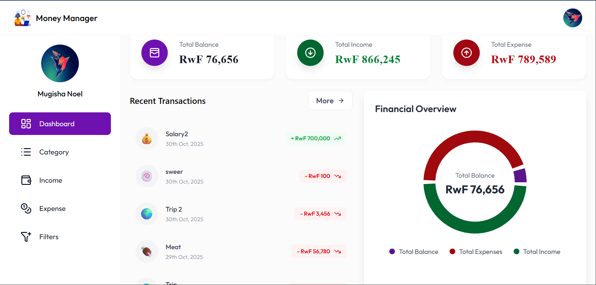
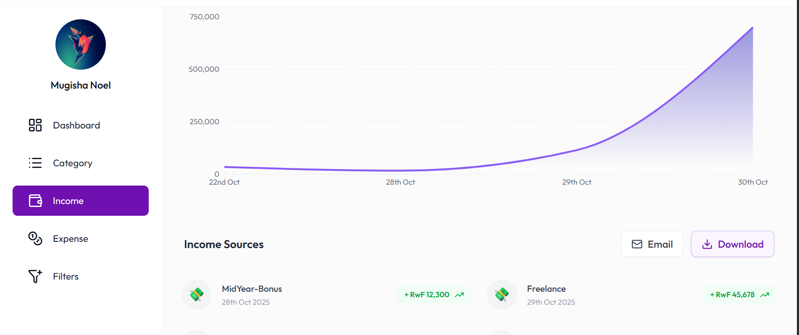
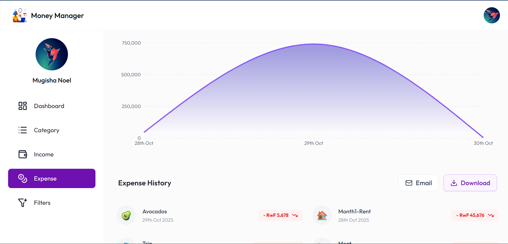
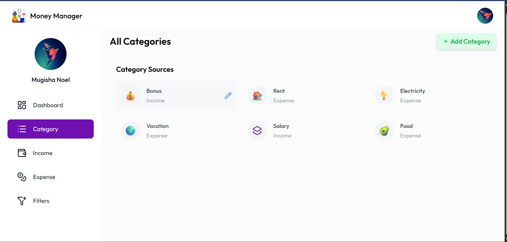

# 💰 Money Manager

<div align="center">

**Take Control of Your Finances with Ease. A modern, secure, and intuitive application to track your income and expenses, helping you achieve your financial goals.**

</div>

<p align="center">
  <a href="[YOUR_DEPLOYED_APP_LINK]" target="_blank">
    
  </a>
</p>

## ✨ Application Preview

<div align="center">
  <table>
    <tr>
      <td align="center"><strong>Dashboard Overview</strong></td>
      <td align="center"><strong>Income Tracking</strong></td>
    </tr>
    <tr>
      <td></td>
      <td></td>
    </tr>
    <tr>
      <td align="center"><strong>Expense Management</strong></td>
      <td align="center"><strong>Category Organization</strong></td>
    </tr>
    <tr>
      <td></td>
      <td></td>
    </tr>
  </table>
</div>

> **Note**: The images above are placeholders. Please follow the instructions to replace them with actual screenshots of your application.

## 🚀 About The Project

Money Manager is a full-stack web application designed to provide users with a simple yet powerful tool for personal finance management. It allows users to effortlessly log their daily transactions, categorize them, and visualize their financial habits over time. With a secure backend and a responsive, user-friendly frontend, managing your money has never been easier.

The primary goal of this project is to empower users to make informed financial decisions by offering a clear overview of their income streams and spending patterns.

## 🌟 Key Features

*   🔐 **Secure Authentication**: User registration with email verification, and secure login using JWT (JSON Web Tokens).
*   📊 **Interactive Dashboard**: A comprehensive overview of total balance, income, and expenses with beautiful charts and recent transaction lists.
*   📈 **Income & Expense Tracking**: Easily add, view, and delete income and expense records.
*   🗂️ **Category Management**: Create and manage custom categories for both income and expenses to organize transactions effectively.
*   🔍 **Advanced Filtering**: Filter transactions by type (income/expense), date range, and keywords.
*   📥 **Data Export**: Download your transaction history (income or expenses) as an Excel spreadsheet.
*   📧 **Email Reports & Notifications**:
    *   Receive your monthly transaction reports directly in your email.
    *   Get daily reminders to log your transactions.
    *   Receive a daily summary of your expenses.
*   🖼️ **User Profile**: Users can upload a custom profile picture.
*   📱 **Responsive Design**: A seamless experience across desktop and mobile devices.

## 🛠️ Tech Stack

This project is built with a modern and robust technology stack.

### Backend


### Frontend


## ⚙️ Getting Started

To get a local copy up and running, follow these simple steps.

### Prerequisites

*   Java 21 or higher
*   Maven 3.8+
*   Node.js 18+
*   PostgreSQL
*   Docker (Optional)

### Installation & Setup

1.  **Clone the repository:**
    ```sh
    git clone https://github.com/your-username/your-repo-name.git
    cd your-repo-name
    ```

2.  **Backend Setup:**
    *   Navigate to the `backend` directory: `cd backend`
    *   Create a `.env` file from the `.env.example` and fill in your database, JWT, and email credentials.
    *   Run the application:
        ```sh
        ./mvnw spring-boot:run
        ```
    *   The backend server will start on `http://localhost:8080`.

3.  **Frontend Setup:**
    *   Navigate to the `frontend` directory: `cd ../frontend`
    *   Create a `.env` file from the `.env.example` and set the `VITE_BACKEND_URL` to `http://localhost:8080/api/v1`. Also, add your Cloudinary credentials.
    *   Install NPM packages:
        ```sh
        npm install
        ```
    *   Start the development server:
        ```sh
        npm run dev
        ```
    *   Open your browser and navigate to `http://localhost:5173`.

## 📫 Contact

For more information, feel free to reach out!

**Noel Mugisha** - [noelmugish332@gmail.com](mailto:noelmugish332@gmail.com)

Project Link: [https://github.com/your-username/your-repo-name](https://github.com/your-username/your-repo-name)
